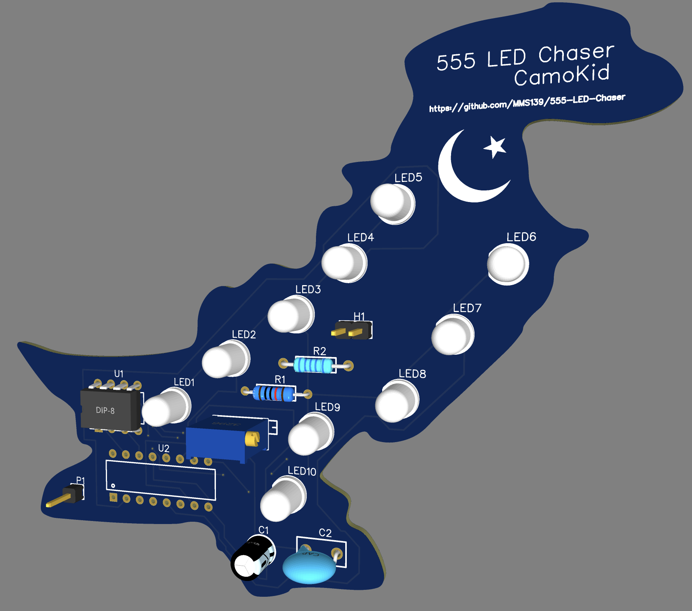

# 555 LED Chaser
Mini board with flashing lights I followed the Blinky guide on [Blueprint](https://blueprint.hackclub.com/), but customised the board shape to the shape of Pakistan. I also added a crescent and star as my art. This is my first project in Blueprint, but also my first hardware project. I used this project so I could follow the other Blueprint guides.

The project can be viewed at this link:
[https://blueprint.hackclub.com/projects/1187](https://blueprint.hackclub.com/projects/1187)

## Components
This project features the following components:
* 10 LEDs
* NE555 timer
* CD4017
* Variable resistors

## Images

I hope I can use this project to help me understand hardware more and build more projects in the future.
